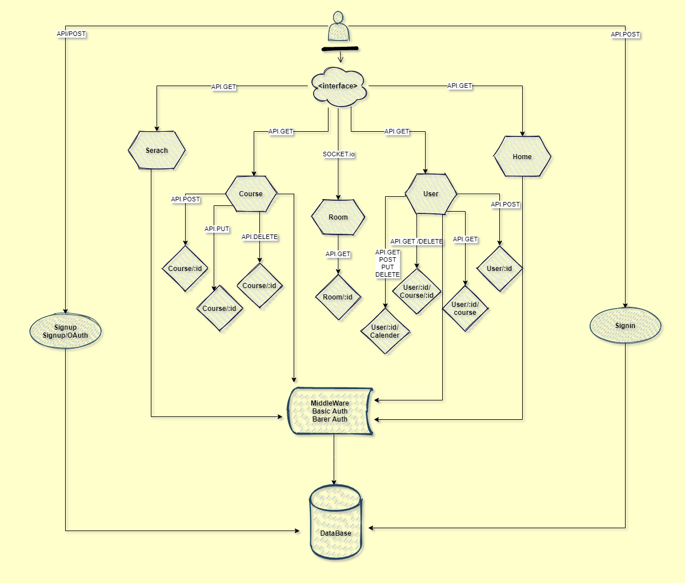

# Linked-Learn

## Overview
Learning management system.

### Authors:
Afnan Damra - Ahmad Alfrijat - Bashar Nofal - Ruba Banat - Zaid Alasfar

### Problem Domain:
These days the world is moving too fast and we need to keep up with it, and with the current situation and how hard it became to attend courses and meet people to learn from, we thought about a web app that helps people do that.

### Architecture
#### libraries, frameworks and packages
javascript, nodejs, express, postgresql, socket.io, peerjs

## Project Management Tool
[Trello](https://trello.com/b/j9lBB6SL)

## Wireframes:

### Domain Modeling

### Entity Relationship Diagram

<!-- ## Credits and Collaborations: -->
