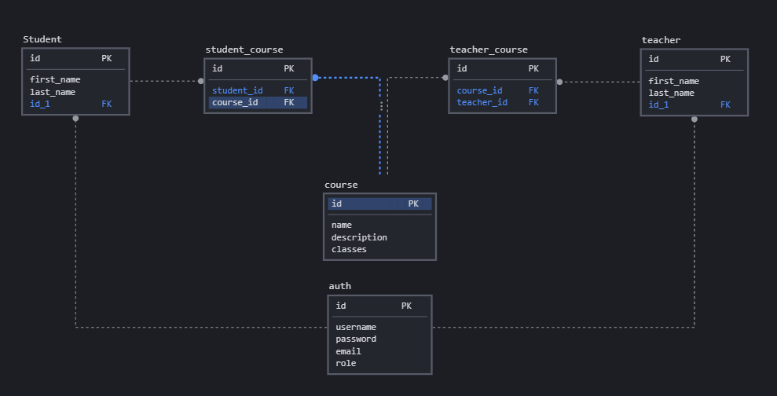

# Linked-Learn

## Overview
Learning management system.

### Authors:
Afnan Damra - Ahmad Alfrijat - Bashar Nofal - Ruba Banat - Zaid Alasfar

### Problem Domain:
These days the world is moving too fast and we need to keep up with it, and with the current situation and how hard it became to attend courses and meet people to learn from, we thought about a web app that helps people do that.

### Architecture
#### libraries, frameworks and packages
javascript, nodejs, express, postgresql, socket.io, peerjs

## Project Management Tool
[Trello](https://trello.com/b/j9lBB6SL)

## Wireframes:

### Domain Modeling

### Entity Relationship Diagram

### User Stories:
1. As a student, I want to create an account
2. As a student, I want to be able to search through all courses
3. As a student, I want to add courses to my watch list
4. As a student, I want to be able to communicate with instructors and other students and meet them
5. As a student, I want to be able to ask questions and give my opinions about courses.
6. As a teacher, I want to create an account.
7. As a teacher, I want to be able to upload courses to my accounts and edit them.
8. As a teacher, I want to know the students who interested in my courses.
9. As a teacher I want to schedule a 1:1 meeting with students.
10. As a teacher I want to see students comments and questions and answer them.
11. As an admin I want to have an access to whole courses , teachers and students accounts.

<!-- ## Credits and Collaborations: -->
