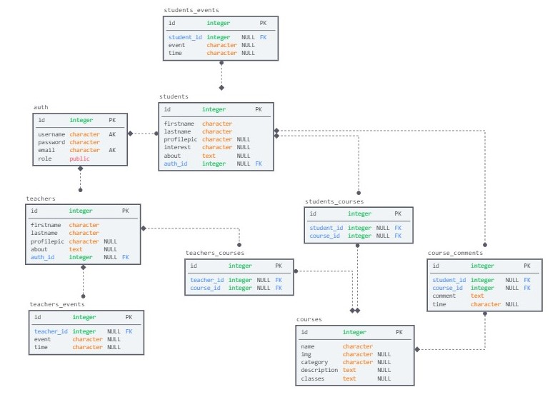
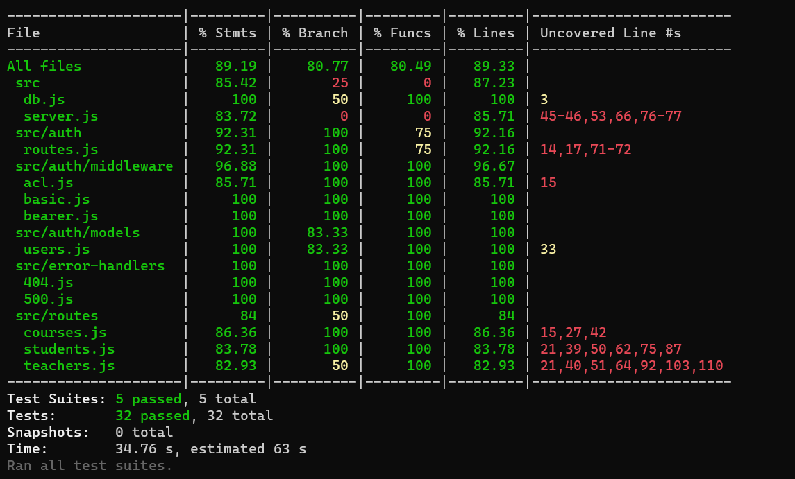
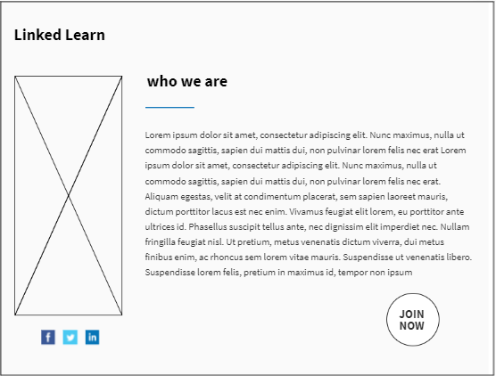
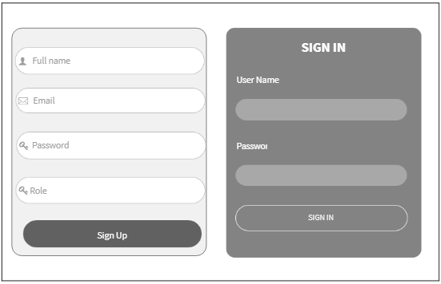
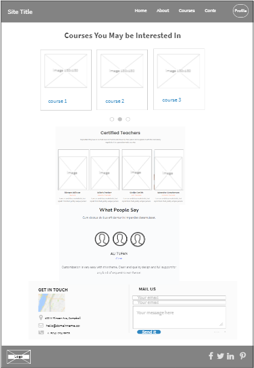
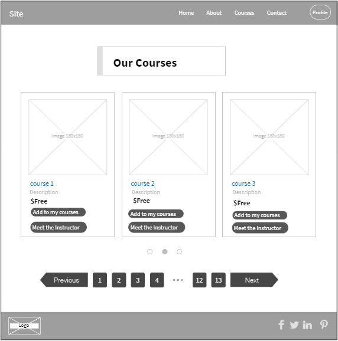
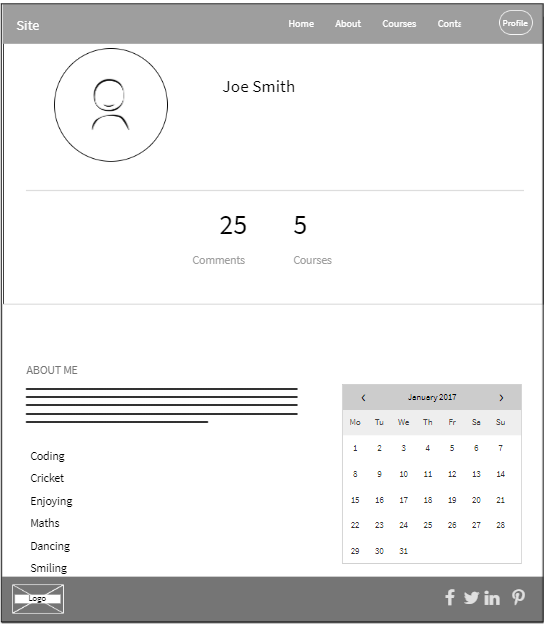
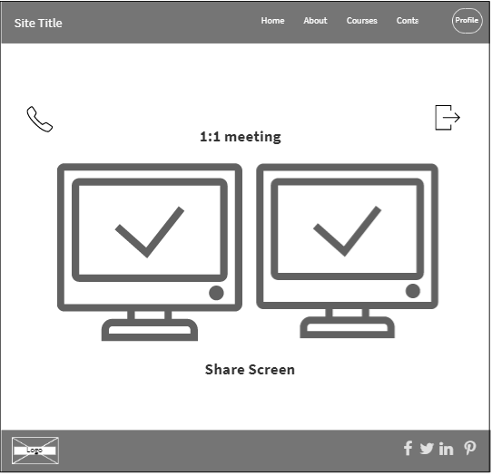
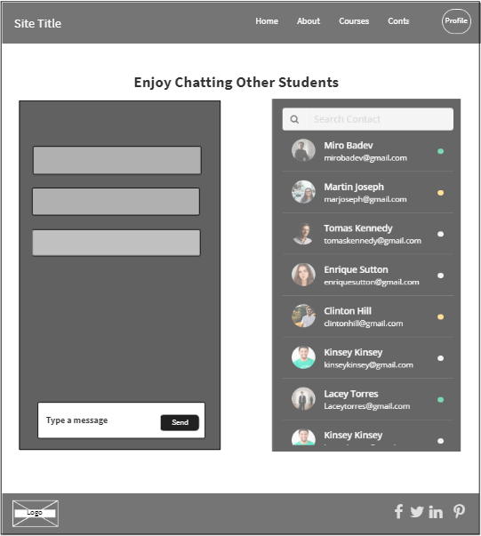

# Linked-Learn

## Overview
Learning management system.

### Authors:
Afnan Damra - Ahmad Alfrijat - Bashar Nofal - Ruba Banat - Zaid Alasfar

### Problem Domain:
These days the world is moving too fast and we need to keep up with it, and with the current situation and how hard it became to attend courses and meet people to learn from, we thought about a web app that helps people do that.

----

### Architecture
#### libraries, frameworks and packages
javascript, nodejs, express, postgresql, socket.io, peerjs

### Project Management Tool
[Trello](https://trello.com/b/j9lBB6SL)

### Domain Modeling

### Entity Relationship Diagram

### Testing

----

## Features & Routes

### **Home** (/)

| Method | Endpoint | Description  |
| :---: | :--- | :--- |
| GET | / | home page, with a website description and a button to join |

------

### **Auth** (/auth)

| Method | Endpoint | Description  |
| :---: | :--- | :--- |
| GET | /signup | Shows signup form |
| POST | /signup | Submit signup form |
| GET | /signin | Shows signin form |
| POST | /signin | Submit signin form |
| GET | /google | OAuth with Google |

------

### **Dashboard**

| Method | Endpoint | Description |
| :--- | :--- | :--- |
| GET | /home | home page after joining, with a website description, courses, and some information |

------

### **Courses** (/courses)

| Method  | Endpoint | Description  |
| :--- | :--- | :--- |
| GET | /courses | Shows all courses, and a user can search |
| GET | /courses/:id | Shows course details, with commments if available |

| Method  | Endpoint | Description  |
| :--- | :--- | :--- |
| POST | /courses/:id/comment | Used to add a comment on the current course |
| DELETE | /courses/:id/comment | Used to delete a comment from the current course |

------

### **Students** (/student)

| Method  | Endpoint | Description  |
| :--- | :--- | :--- |
| GET | /student/profile | Shows the student profile |
| PATCH | /student/profile | Edit profile data |

| Method  | Endpoint | Description  |
| :--- | :--- | :--- |
| GET | /student/profile/events | Shows the student calendar, with available and booked dates |
| POST | /student/profile/events | Adds an event to the student calendar |
| GET | /student/profile/events/:id | Shows exstra information about an event |
| PATCH | /student/profile/events/:id | Edits an event information for the student |
| DELETE | /student/profile/events/:id | Deletes an event from the students profile |

| Method  | Endpoint | Description  |
| :--- | :--- | :--- |
| GET | /student/courses | Shows all courses for the student |
| POST | /student/courses | Adds a new course to the student profile |
| GET | /student/courses/:id | Shows course details, with comments if available for the student |
| DELETE | /student/courses/:id | Used to delete a course from the student profile |

------

### **Teachers** (/teacher)

| Method  | Endpoint | Description  |
| :--- | :--- | :--- |
| GET | /teacher/profile | Shows the teacher profile |
| PATCH | /teacher/profile | Edit profile data |

| Method  | Endpoint | Description  |
| :--- | :--- | :--- |
| GET | /teacher/profile/events | Shows the teacher calendar, with available and booked dates |
| POST | /teacher/profile/events | Adds an event to the teacher calendar |
| GET | /teacher/profile/events/:id | Shows exstra information about an event |
| PATCH | /teacher/profile/events/:id | Edits an event information for the teacher |
| DELETE | /teacher/profile/events/:id | Deletes an event from the teachers profile |

| Method  | Endpoint | Description  |
| :--- | :--- | :--- |
| GET | /teacher/courses | Shows all courses for the teacher |
| POST | /teacher/courses | Adds a new course to the teacher profile |
| GET | /teacher/courses/:id | Shows course details, with comments if available for the teacher |
| DELETE | /teacher/courses/:id | Used to delete a course from the teacher profile |

------

### **Chatting**

| Method | Endpoint | Description |
| :--- | :--- | :--- |
| GET | /chat | shows available chat rooms, with the ability to join and participate (public chat rooms) |

------

### **Meeting**

| Method | Endpoint | Description |
| :--- | :--- | :--- |
| GET | /video | gives the ability to join a call by id (private calls for 1:1 meetings) |

----

## Wireframes:

<!-- ## Credits and Collaborations: -->
